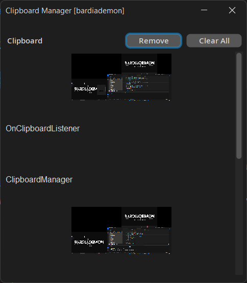

# 📋 Clipboard Manager

<h1 align="center">
    
</h1>

📝 A desktop application written in `Java 21` for managing clipboard content. The application listens to the clipboard, stores clipboard items in an SQLite database, and allows you to manage and organize clipboard entries based on content type `STRING`, `FILE`, `IMAGE`.

## 🌟 Features

- **Clipboard Monitoring:** Continuously monitors and stores clipboard content (STRING, FILE, IMAGE) in an SQLite database.
- **Configurable Storage Limit:** You can configure how many clipboard entries to store in the database. Older entries are automatically deleted when the limit is exceeded.
- **Graphical Interface:** Press the configured shortcut (e.g., **Ctrl + Alt + X** or **F5**) to open a graphical interface to view, delete, or re-add clipboard entries. By default, the shortcut is set to **F7**, but it can be customized in the **ui_shortcut** field of the configuration.
- **Content Management:** Supports STRING, FILE, and IMAGE clipboard types.
- **Single/Multiple Item Deletion:** You can delete individual clipboard entries or remove all items at once.

## ⚡ Requirements

- Java 21 or higher

## 🔧 Installation

### Build the Application

1. Clone the repository:

```bash
   git clone https://github.com/bardiademon/ClipboardManager
```

```bash
   cd ClipboardManager
```

#### Compile and package the application using Maven:

```bash
  mvn clean install package
```

#### Run the packaged JAR file:

```bash
  java -jar target/JARNAME.jar
```

#### Run Background on Windows

```shell
  javaw -jar target/JARNAME.jar
```

<hr/>

> **Note**:
> The configuration file and SQLite database will be automatically created on the first run.

## ⚙️ Configuration

You can set the number of clipboard entries to store in the config file. The program will delete older clipboard entries once the limit is exceeded. An example config file in JSON format:

```json
{
  "ui_shortcut": "F7",
  "clipboard_types": [
    "FILE",
    "STRING",
    "IMAGE"
  ],
  "clipboard_save_count": 50
}
```

## 🚀 Usage

Run the application using the command above.
The program will listen to the clipboard and store entries in the SQLite database.
Press the configured shortcut (e.g., **Ctrl + Alt + X** or **F5**) to open the graphical interface where you can:

View the number of stored clipboard entries.
Delete entries (either one by one or all at once).
Re-add older clipboard entries to your current clipboard.
By default, the shortcut is set to **F7**, but it can be customized in the **ui_shortcut** field of the configuration.

## 💻 Technologies

<div align="center">
    
</div>

## 🌟 Spread the word!

If you want to say thank you:

- Add a GitHub Star to the project!
- Follow my GitHub [bardiademon](https://github.com/bardiademon)

## ⚠️ License & 📝 Credits

by bardiademon [https://bardiademon.com](https://www.bardiademon.com)
